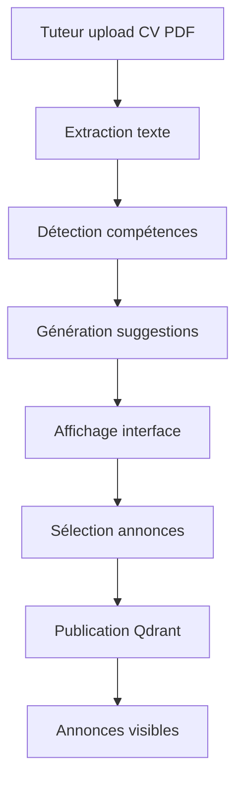

# 🚀 Guide de Démarrage - Création d'Annonces par CV

## ✅ Ce qui a été créé

### 1. **Page Web** : `create-listing-cv.html`
Interface complète pour uploader un CV et créer des annonces automatiquement

### 2. **Service d'analyse** : `cv-analyzer.js`
- Extraction de texte depuis PDF
- Détection automatique de compétences (15+ domaines)
- Génération de suggestions de cours
- Détection du niveau d'études

### 3. **API Endpoint** : `POST /analyze-cv`
Reçoit un PDF, retourne les compétences et suggestions

### 4. **Route Frontend** : `/create-listing-cv`
Accès direct à la page d'upload

## 📍 Accès

**URL principale :**
```
http://localhost/create-listing-cv
```

**API :**
```
http://localhost:81/analyze-cv
```

## 🎯 Test rapide

### Option 1 : Via l'interface web

1. Ouvrir : http://localhost/create-listing-cv
2. Uploader un CV PDF (ou drag & drop)
3. Attendre l'analyse (2-3 secondes)
4. Voir les compétences détectées
5. Sélectionner les cours à publier
6. Cliquer sur "Publier les annonces sélectionnées"

### Option 2 : Test API avec cURL

```powershell
# Tester l'endpoint d'analyse
curl -X POST http://localhost:81/analyze-cv `
  -F "cv=@C:\chemin\vers\votre\CV.pdf"
```

## 📄 Créer un CV de test

Si vous n'avez pas de CV, créez un fichier texte simple et convertissez-le en PDF :

**Exemple de contenu :**
```
Jean Dupont
Étudiant en Master Informatique
Université de Paris

COMPÉTENCES :
- Programmation Python, JavaScript
- Développement Web
- Mathématiques appliquées
- Physique-Chimie
- Anglais courant (TOEIC 850)

EXPÉRIENCE :
- Cours particuliers en mathématiques (2 ans)
- Développeur web freelance
```

Sauvegardez en PDF et uploadez-le !

## 🎨 Fonctionnalités de la page

✅ **Upload**
- Drag & drop supporté
- Validation PDF uniquement
- Taille max : 5MB
- Indicateur de fichier sélectionné

✅ **Analyse**
- Spinner de chargement
- Extraction automatique des compétences
- Affichage des badges de compétences

✅ **Suggestions**
- Cartes interactives
- Titre, description, prix suggérés
- Badges sujet et niveau
- Checkbox de sélection

✅ **Publication**
- Publication en lot
- Message de succès
- Lien direct vers les annonces
- Option de recommencer

## 🔍 Compétences reconnues

Le système détecte automatiquement :

| Matière | Prix suggéré |
|---------|--------------|
| Mathématiques | 15-22€/h |
| Physique-Chimie | 18-22€/h |
| Informatique | 25-30€/h |
| Anglais | 18-22€/h |
| Français | 16-20€/h |
| Espagnol | 16-20€/h |
| Allemand | 17-21€/h |
| Histoire-Géo | 14-18€/h |
| Philosophie | 18-22€/h |
| Économie (SES) | 18-22€/h |
| SVT | 16-20€/h |

## 📊 Exemple de réponse API

```json
{
  "success": true,
  "skills": [
    "Mathématiques",
    "Informatique",
    "Anglais"
  ],
  "suggestions": [
    {
      "title": "Cours de Mathématiques - Algèbre et Géométrie",
      "description": "Aide aux devoirs en mathématiques...",
      "subject": "Mathématiques",
      "level": "Lycée/Supérieur",
      "price": 18,
      "tutor_name": "Jean Dupont"
    },
    {
      "title": "Programmation Python - Cours particuliers",
      "description": "Cours de programmation pour débutants...",
      "subject": "Informatique",
      "level": "Lycée/Supérieur",
      "price": 28,
      "tutor_name": "Jean Dupont"
    }
  ],
  "tutorName": "Jean Dupont",
  "detectedLevel": "Lycée/Supérieur"
}
```

## 🔄 Workflow complet



## 🛠️ Technologies utilisées

- **Frontend** : HTML5, CSS3, JavaScript Vanilla
- **Backend** : Node.js, Express
- **Upload** : Multer (multipart/form-data)
- **PDF Parsing** : pdf-parse
- **Indexation** : Qdrant (recherche vectorielle)

## 🎓 Cas d'usage

### Cas 1 : Étudiant en ingénierie
**CV contient :** Maths, Physique, Programmation
**Suggestions** : 6 annonces générées (2 par matière)

### Cas 2 : Étudiant en langues
**CV contient :** Anglais, Espagnol, Français
**Suggestions** : 6 annonces de cours de langues

### Cas 3 : Profil mixte
**CV contient :** Maths, Informatique, Anglais, Économie
**Suggestions** : 8 annonces variées

## 🚨 Gestion d'erreurs

| Erreur | Solution |
|--------|----------|
| "Aucune compétence détectée" | Vérifier que le CV contient des mots-clés reconnus |
| "Impossible de lire le PDF" | PDF corrompu ou protégé par mot de passe |
| "Fichier trop volumineux" | Réduire la taille (max 5MB) |
| "Format non accepté" | Uploader uniquement un PDF |

## 📈 Statistiques

Après publication, les annonces sont :
- ✅ **Indexées** dans Qdrant
- ✅ **Cherchables** via `/listings/search`
- ✅ **Visibles** sur `/test-listings`
- ✅ **Récupérables** via `/listings`

## 🔗 Liens utiles

- **Page de création** : http://localhost/create-listing-cv
- **Liste des annonces** : http://localhost/test-listings
- **API Qdrant** : http://localhost:81/listings
- **Dashboard Qdrant** : http://localhost:6333/dashboard

---

## 🎉 Prêt à tester !

1. Accédez à : **http://localhost/create-listing-cv**
2. Uploadez votre CV
3. Validez les suggestions
4. Publiez vos annonces
5. Vérifiez sur http://localhost/test-listings

**Bonne création d'annonces ! 🚀**
